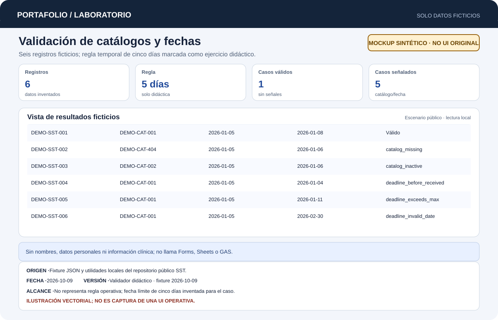

# Digitalización, Gobernanza y Analítica de Seguridad y Salud en el Trabajo

Automatización de flujos de registro, gobernanza de catálogos y analítica de SST con Google Apps Script y Google Sheets.

> [!NOTE]
> **Repositorio documental.** El código operativo permanece privado debido a la confidencialidad de la información operativa. Aquí se publican documentación de arquitectura, evidencia técnica, captura ilustrativa y un ejemplo sintético reproducible sin datos clínicos reales.

[Probar el ejemplo](#probar-el-ejemplo) · [Caso de estudio](docs/case-study.md) · [Arquitectura](docs/architecture.md) · [Verificación y límites](docs/verification.md)

[Abrir demo interactiva](demo/index.html) · [Ampliar mockup sintético](docs/images/mockup-synthetic.svg)

## Problema

La gestión de incidentes y registros de Seguridad y Salud en el Trabajo (SST) genera un flujo continuo de formularios que deben clasificarse, validarse contra catálogos vigentes y registrarse con estricta confidencialidad. Los procesos manuales provocan desajustes en fechas y semanas epidemiológicas/operativas, inconsistencias en catálogos y riesgo de divulgación no autorizada de datos personales.

## Solución

Un flujo automatizado en Google Apps Script que procesa formularios y resguarda la gobernanza del dato:
- **Procesamiento estructurado de respuestas:** enrutamiento automático según el tipo de registro o incidente.
- **Validación contra catálogos:** cruce automático de referencias y actualización en Google Sheets mediante escrituras por lotes.
- **Control de concurrencia:** uso de `DocumentLock` con liberación obligatoria en bloques `finally` para evitar colisiones entre registros.
- **Normalización temporal:** cálculo automatizado de fechas, semanas ISO y periodos para análisis en tableros sin manipular registros manualmente.



*Seis registros ficticios; la regla de cinco días es didáctica. No ejecuta la aplicación operativa.*

## Aportación personal

Analicé y verifiqué los requerimientos de registro y reporte del área de SST para implementar los flujos automatizados en Google Apps Script: diseñé el procesamiento estructurado de formularios, el cálculo automatizado de semanas ISO y la actualización controlada de catálogos en Google Sheets con `DocumentLock`, asegurando la gobernanza y confidencialidad de la información.

## Probar el ejemplo

Requiere Python 3 y biblioteca estándar. Desde la raíz del repositorio:

```text
python examples/verify.py
```

Valida seis registros ficticios: referencia activa, referencia ausente o inactiva, fecha límite anterior, fecha fuera del plazo y fecha de calendario imposible. También imprime la semana ISO de una fecha válida.

La regla de cinco días naturales y los catálogos pertenecen al ejemplo didáctico. No se presentan como reglas del proceso operativo.

Para explorar el flujo en el navegador, abra [demo/index.html](demo/index.html) de forma local.

## Resultados comprobados

- **Automatización y gobernanza:** 27 funciones identificadas e inspeccionadas en el proyecto GAS (5 de octubre de 2026), cubriendo enrutamiento, validación y utilidades.
- **Ejemplo reproducible de gobernanza:** validación de referencias de catálogo y fechas límite con escenarios sintéticos; la regla de plazo se declara como ilustrativa.
- **Evidencia histórica separada:** 4 casos de utilidades puras verificados localmente sin servicios Google el 5 de octubre de 2026.
- **Privacidad estricta:** el ejemplo didáctico y la documentación omiten cualquier referencia clínica o dato personal sensible.

No se publican métricas no medidas de reducción de tiempos o accidentabilidad.

## Tecnologías

| Alcance | Tecnologías |
|---|---|
| Observadas en la fuente | Google Apps Script, Google Sheets, Google Forms, Looker Studio |
| Ejemplo público | Python 3 (biblioteca estándar), HTML/CSS estático |
| Reportada, pendiente de inspección | BigQuery y consultas SQL reportadas por el solicitante |

## Límites

- El endpoint HTTP GAS analizado devolvió `Script function not found: doGet` al consultarlo vía web; esto afecta la consulta web directa, aunque no invalida los activadores vinculados a formularios y hojas.
- El ejemplo Python rechaza fechas imposibles, pero no acredita que el sistema GAS privado aplique la misma validación; la normalización del código revisado puede desplazar días a otro mes.
- El código operativo permanece privado por normativas de privacidad y seguridad del dato.

Detalle técnico y condiciones pendientes: [verificación y límites](docs/verification.md).

## Licencia

Pendiente de decisión expresa. No se asigna licencia ni derechos sobre el código privado.
