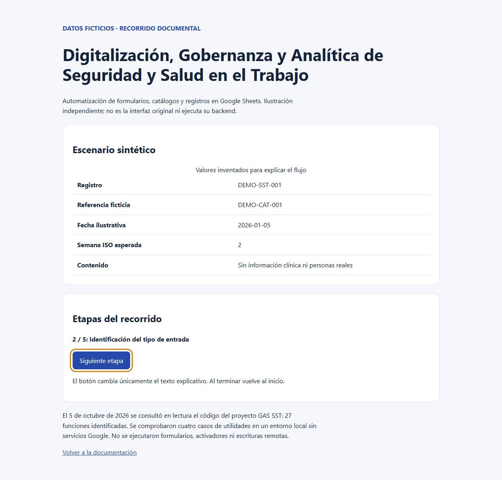

# Digitalización, Gobernanza y Analítica de Seguridad y Salud en el Trabajo

Automatización de formularios, catálogos y registros en Google Sheets.

**Estado:** caso de estudio documental de un proyecto Google Apps Script consultado en lectura. El código operativo y sus datos no se distribuyen en este repositorio. Se publican documentación nueva y un recorrido ilustrativo con datos ficticios.

## Problema y solución

Organizar la captura y actualización de registros de SST relacionados con catálogos, fechas e inventario, conservando la privacidad de la información.

El proyecto GAS revisado recibe respuestas de formularios, busca referencias de catálogo y actualiza hojas. Incluye un enrutador de edición con bloqueo y utilidades de fechas.

## Funciones observadas en la fuente

- Procesador de formulario que organiza entradas según su tipo.
- Búsqueda de referencias en catálogos y actualización de columnas por lotes.
- Enrutador de eventos de edición con DocumentLock y liberación en finally.
- Actualizaciones separadas de registros e inventario.
- Funciones de normalización de fecha, semana ISO y nombre del mes.

## Tecnologías verificadas

Google Apps Script, Google Sheets, Google Forms. Consulte la [arquitectura](docs/architecture.md) para su función.

El informe Looker Studio facilitado abre. Su conexión BigQuery fue reportada por el solicitante; no se inspeccionó el SQL. El endpoint HTTP GAS devuelve `Script function not found: doGet`. La [verificación](docs/verification.md) registra estos límites sin publicar enlaces operativos.

## Evidencia y resultados

El 5 de octubre de 2026 se consultó en lectura el código del proyecto GAS SST: 27 funciones identificadas. Se comprobaron cuatro casos de utilidades en un entorno local sin servicios Google. No se ejecutaron formularios, activadores ni escrituras remotas.

No se publican métricas de ahorro, adopción o productividad. La [verificación](docs/verification.md) explica su alcance. La aportación personal detallada y la autoría integral del código operativo no están acreditadas públicamente; este caso presenta la revisión técnica y la documentación del proyecto asociado al portafolio.

## Demostración y capturas

Abra [demo/index.html](demo/index.html) localmente. El recorrido funciona sin servidor, instalación ni conexión a servicios. Su tabla representa [datos sintéticos](examples/scenario.json), no una captura de la aplicación original. El botón recorre textos ilustrativos; no ejecuta operaciones de negocio.

Puede verificar los datos usando Python 3: `python examples/verify.py`.

## Caso de estudio

Consulte [problema, decisiones y aprendizajes](docs/case-study.md).

## Seguridad y limitaciones

Publicación independiente sin historial operativo. No incluye credenciales, identificadores de servicios, catálogos empresariales, datos personales, archivos de respaldo ni configuración productiva. Las pruebas de la fuente se ejecutaron con simulación o temporales aislados; el recorrido público es una explicación independiente.

## Pendientes

- Verificar formularios y activadores en una copia aislada con registros ficticios.
- Revisar acceso, retención y distribución por la sensibilidad de los registros.
- Corregir o validar fechas imposibles: la normalización simple puede desplazar días a otro mes.
- Evaluar eventos omitidos cuando el bloqueo está ocupado; reporting y aceptación humana pendientes.
- Acreditar responsabilidades históricas y decidir licencia.

## Licencia

Pendiente de decisión expresa. No se asigna una licencia de software ni se atribuyen derechos sobre el código operativo.
