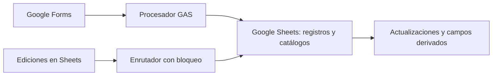

# Arquitectura revisada

Fecha: 2026-10-05. Diagrama del alcance observado, con nombres de componentes genéricos.

## Componentes y responsabilidades

- Procesador de formulario que organiza entradas según su tipo.
- Búsqueda de referencias en catálogos y actualización de columnas por lotes.
- Enrutador de eventos de edición con DocumentLock y liberación en finally.
- Actualizaciones separadas de registros e inventario.
- Funciones de normalización de fecha, semana ISO y nombre del mes.

## Arquitectura del repositorio público

Este repositorio contiene Markdown, un JSON sintético, un verificador Python de biblioteca estándar y un recorrido HTML autónomo. No contiene backend, servicios externos ni réplica del sistema operativo. El diagrama anterior describe la fuente local revisada.

## Límites

- Verificar formularios y activadores en una copia aislada con registros ficticios.
- Revisar acceso, retención y distribución por la sensibilidad de los registros.
- Corregir o validar fechas imposibles: la normalización simple puede desplazar días a otro mes.
- Evaluar eventos omitidos cuando el bloqueo está ocupado; reporting y aceptación humana pendientes.
- Definición de licencia en su fase técnica propia.
